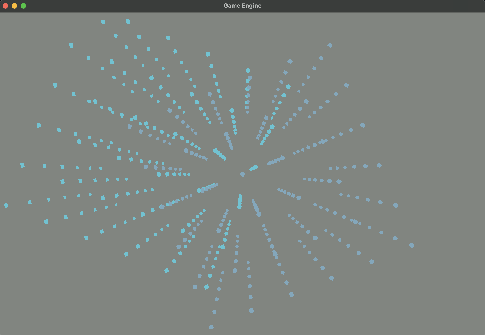

# Game-Engine-Tutorial

## Overview

Tutorial where I learned to build a 3D engine from ground up for Apple platforms with Metal shaders.

## Technologies

_MacOS_ | _Metal Render Pipeline_ 

## Images



## Usage

### Prerequisites

- Xcode (See: https://developer.apple.com/xcode/)

### Installation

1. Clone this repository:

   ```bash
   git clone https://github.com/chris-prenissl/Game-Engine-Tutorial.git
   ```

2. Start Xcode

3. Build and Run.

## License

This project is licensed under the MIT License - see the [LICENSE](LICENSE.md) file for details.
